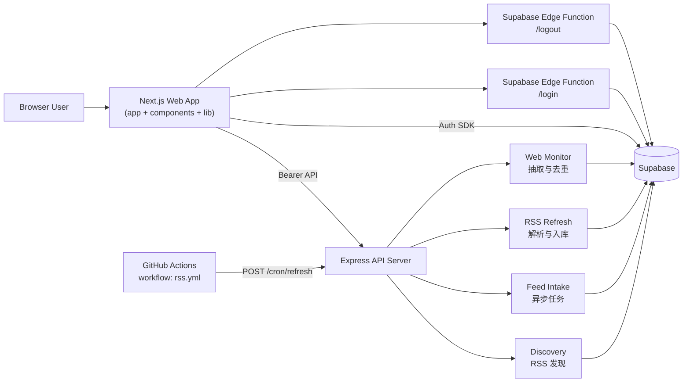
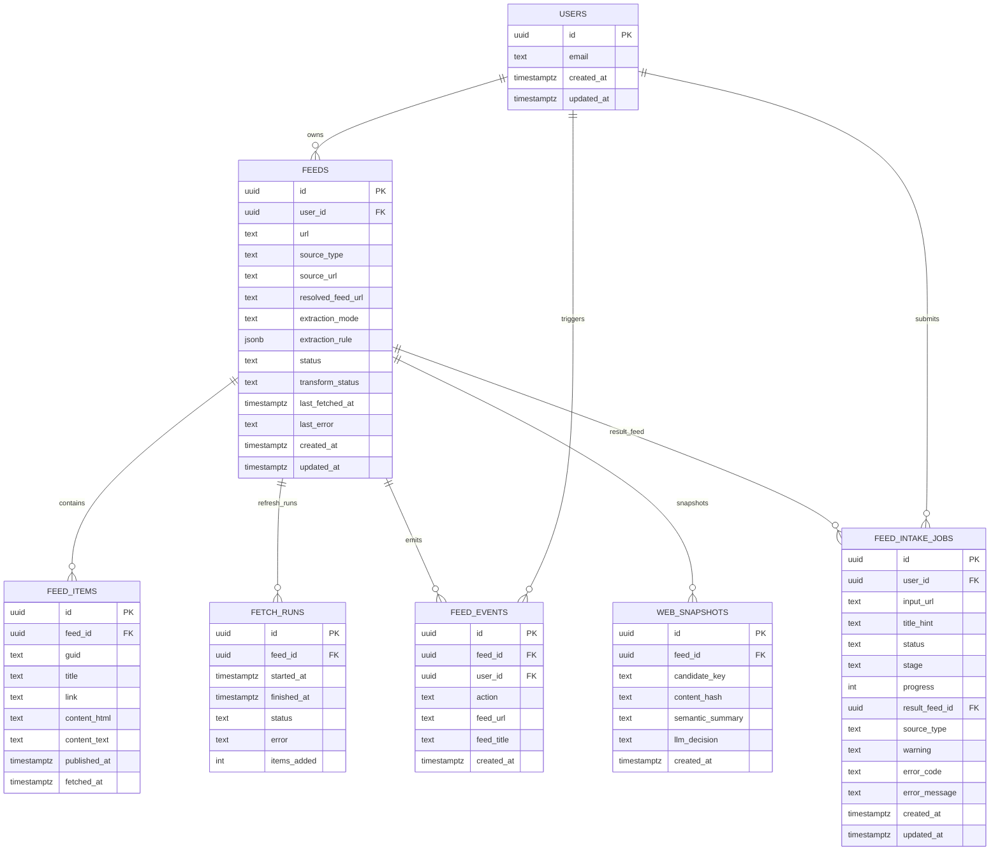
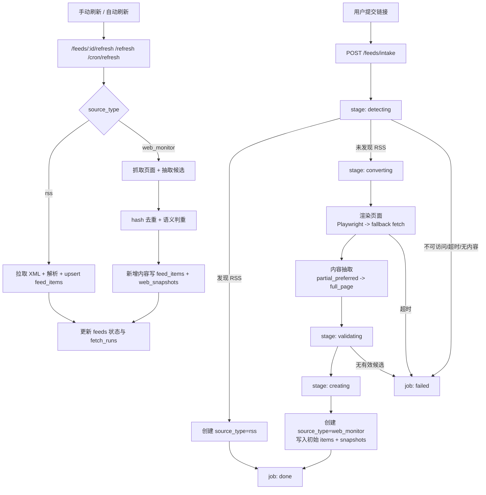

# RSS-Bot

一个面向团队协作的 RSS 与网页订阅平台：支持账号鉴权、RSS 管理、非 RSS 链接自动转换、定时刷新与增量去重阅读。  
品牌主张：**RSS-Bot 使用AI重塑订阅**。

## 目录
- [项目背景与目标](#项目背景与目标)
- [核心能力概览](#核心能力概览)
- [系统模块说明](#系统模块说明)
- [技术架构图（Mermaid）](#技术架构图mermaid)
- [模块数据结构图（Mermaid ER）](#模块数据结构图mermaid-er)
- [数据流图（Mermaid Flow）](#数据流图mermaid-flow)
- [快速开始（从 0 到可用）](#快速开始从-0-到可用)
- [使用说明（按场景）](#使用说明按场景)
- [API 概览（按域）](#api-概览按域)
- [环境变量说明](#环境变量说明)
- [LLM 接入说明（可插拔适配器）](#llm-接入说明可插拔适配器)
- [测试与验证](#测试与验证)
- [部署与运维入口](#部署与运维入口)
- [常见问题与排障](#常见问题与排障)
- [相关文档索引](#相关文档索引)

## 项目背景与目标
### 背景
- 信息源分散：用户往往同时关注 RSS、博客、资讯站、专题页。
- 订阅失败成本高：很多链接不是 RSS，直接添加会失败，用户缺少可解释反馈。
- 页面噪声大：网页模板变化频繁，若直接整页抓取会导致重复或低价值更新。

### 目标
- 统一订阅入口：一个输入框同时接收 RSS/Atom 与普通网页链接。
- 自动化转换：优先识别真实 RSS；不支持时转为网页监控源（`web_monitor`）。
- 可读的增量更新：通过快照与去重策略，仅沉淀有价值的变化内容。

### 读者对象
- 产品同学：理解能力边界、核心流程、状态与失败场景。
- 开发同学：快速定位模块、接口、数据模型、运行方式。
- 运维与部署同学：快速定位配置、健康检查与定时任务入口。

## 核心能力概览
- 账号鉴权与用户隔离（Supabase Auth + RLS）。
- RSS 源管理与阅读（创建、编辑、删除、详情、条目列表）。
- 非 RSS 链接 intake 异步处理：`detecting -> converting -> validating -> creating -> done/failed`。
- 定时刷新与手动刷新（`/refresh`、`/feeds/:id/refresh`、`/cron/refresh`）。
- 网页监控源增量去重（启发式 + 可插拔 LLM 适配器）。
- 品牌化 UI 与 SEO 基线（多色主题、favicon、OpenGraph/Twitter、robots、sitemap）。

## 系统模块说明
### 1) 前端应用层
- 目录：`app/`（绝对路径：`/Users/lorenzo.wang/LifeByte/RSS-bot/app`）
- 职责：页面路由、视图编排、鉴权门禁、页面级状态。
- 输入：浏览器事件、用户会话、后端 API 响应。
- 输出：订阅管理界面、阅读界面、任务状态展示。

### 2) 复用组件层
- 目录：`components/`（绝对路径：`/Users/lorenzo.wang/LifeByte/RSS-bot/components`）
- 职责：订阅表单、订阅列表、全局 loading、状态徽标等复用 UI。
- 输入：页面数据与交互事件。
- 输出：统一交互组件与可复用视觉逻辑。

### 3) 前端基础库
- 目录：`lib/`（绝对路径：`/Users/lorenzo.wang/LifeByte/RSS-bot/lib`）
- 职责：API 请求封装（`authFetch`）、Supabase 客户端、类型定义、会话钩子。
- 输入：环境变量、会话 token。
- 输出：统一 API 访问与类型约束。

### 4) 后端路由层
- 目录：`server/src/routes/`（绝对路径：`/Users/lorenzo.wang/LifeByte/RSS-bot/server/src/routes`）
- 职责：按资源域暴露 HTTP 接口（health、feeds、items、refresh、cron、intake）。
- 输入：HTTP 请求与鉴权信息。
- 输出：JSON 响应、错误码、状态码。

### 5) 后端服务层
- 目录：`server/src/services/`（绝对路径：`/Users/lorenzo.wang/LifeByte/RSS-bot/server/src/services`）
- 职责：RSS 发现、拉取解析、intake 执行、网页提取、去重判定、LLM 适配。
- 输入：路由参数、数据库记录、外部页面内容。
- 输出：结构化订阅条目、快照、任务状态。

### 6) 数据层
- 目录：`supabase/`（绝对路径：`/Users/lorenzo.wang/LifeByte/RSS-bot/supabase`）
- 职责：核心表结构、Auth 扩展、RLS 策略、迁移脚本。
- 输入：后端写入与查询。
- 输出：可审计的订阅、条目、任务与快照数据。

### 7) 自动化脚本与 CI
- 目录：`scripts/`、`.github/workflows/`（绝对路径：`/Users/lorenzo.wang/LifeByte/RSS-bot/scripts`、`/Users/lorenzo.wang/LifeByte/RSS-bot/.github/workflows`）
- 职责：环境校验、初始化、smoke、默认订阅导入、定时刷新触发。
- 输入：环境变量、命令参数、GitHub Secrets。
- 输出：可自动化执行的开发与运维流程。

## 技术架构图（Mermaid）


## 模块数据结构图（Mermaid ER）


## 数据流图（Mermaid Flow）


## 快速开始（从 0 到可用）
### 1) 一键初始化
```bash
npm run setup
```

`setup` 会执行：
1. `npm install`
2. 若不存在 `.env`，自动从 `.env.example` 复制
3. 输出数据库初始化顺序
4. 执行 `npm run validate`

### 2) 初始化数据库（Auth 模式）
新环境按顺序执行：
1. `supabase/schema.sql`
2. `supabase/auth_schema.sql`
3. `supabase/rls-auth.sql`

查看顺序提示：
```bash
npm run db:init:auth
```

已有线上环境增量升级请执行：
- `supabase/migrations/20260210_feed_intake.sql`

### 3) 启动开发环境
```bash
npm run dev:all
```
默认地址：
- 前端：`http://localhost:3000`
- 后端：`http://localhost:4000`

### 4) 最小验收
```bash
npm run validate
npm run dev:all
npm run smoke
```

首次验证成功标准：
- `GET /health` 返回 `ok`
- 可以登录并看到订阅列表页
- 可成功新增一个订阅（RSS 或页面链接）
- 刷新接口无 500 错误

## 使用说明（按场景）
### 场景 1：新增 RSS 订阅
1. 打开 `/feeds/new`
2. 输入 RSS/Atom URL
3. 系统在 intake 中命中 RSS，创建 `source_type=rss`

### 场景 2：新增页面订阅（非 RSS）
1. 在 `/feeds/new` 输入普通网页 URL
2. 查看任务状态：`detecting -> converting -> validating -> creating`
3. 成功后创建 `source_type=web_monitor`，自动写入初始内容

### 场景 3：刷新单个或全部订阅
- 单个：`POST /feeds/:id/refresh`
- 全部（当前用户）：`POST /refresh`
- 全部（定时任务）：`POST /cron/refresh`

### 场景 4：导入默认订阅源
```bash
npm run import:default:feeds
```
说明：
- 优先读取 `IMPORT_AUTH_TOKEN` 或 `TEST_AUTH_TOKEN`
- 未提供 token 时，会尝试用测试账号自动登录获取 token

### 场景 5：查看失败原因与重试建议
- `INTAKE_SOURCE_UNAVAILABLE`：链接不可访问，检查 URL/网络
- `INTAKE_CONVERSION_TIMEOUT`：转换超时，建议更换更轻页面
- `WEB_MONITOR_EXTRACTION_EMPTY`：页面无可提取正文，建议换列表页

## API 概览（按域）
### Health（服务与依赖健康）
- `GET /health`
- `GET /health/auth`

### Feeds（订阅管理）
- `GET /feeds`
- `POST /feeds`
- `POST /feeds/intake`
- `GET /feeds/intake/:jobId`
- `GET /feeds/:id`
- `PATCH /feeds/:id`
- `DELETE /feeds/:id`
- `GET /feeds/:id/items`
- `POST /feeds/:id/refresh`

### Items（阅读条目）
- `GET /items/:id`

### Refresh / Cron（刷新与调度）
- `POST /refresh`
- `POST /cron/refresh`

## 环境变量说明
参考：`.env.example`

| 变量名 | 必填 | 作用域 | 默认值 | 安全说明 |
| --- | --- | --- | --- | --- |
| `SUPABASE_URL` | 是 | 后端 + 抓取 | 无 | Supabase 项目地址 |
| `SUPABASE_SERVICE_ROLE_KEY` | 是 | 后端 | 无 | 必须是 `sb_secret_*`，严禁前端暴露 |
| `SUPABASE_ANON_KEY` | 否 | 后端鉴权回退 | 无 | 必须是 anon/public 或 publishable |
| `NEXT_PUBLIC_SUPABASE_URL` | 是 | 前端 | 无 | 浏览器端 Supabase URL |
| `NEXT_PUBLIC_SUPABASE_ANON_KEY` | 是 | 前端 | 无 | 不能使用 `sb_secret_*` |
| `NEXT_PUBLIC_SITE_URL` | 建议 | 前端 + SEO | 空 | 生产环境建议配置站点绝对 URL，用于 canonical/OG |
| `NEXT_PUBLIC_API_BASE_URL` | 是 | 前端 | `http://localhost:4000` | 前端请求后端基础地址 |
| `PORT` | 否 | 后端 | `4000` | Express 监听端口 |
| `ALLOWED_ORIGIN` | 建议 | 后端 | `http://localhost:3000` | 生产环境不要使用 `*` |
| `CRON_SECRET` | 建议 | 后端 cron | 空 | 保护 `/cron/refresh` |
| `RSS_LLM_ADAPTER_PATH` | 否 | 后端服务层 | 空 | LLM 可插拔适配器模块路径 |
| `INTAKE_MAX_CONVERSION_MS` | 否 | 后端服务层 | `20000` | 单次 intake 转换总超时 |
| `INTAKE_FETCH_TIMEOUT_MS` | 否 | 后端服务层 | `12000` | 单页面抓取/渲染超时 |

## LLM 接入说明（可插拔适配器）
当前项目默认不绑定任何 LLM 供应商，`RSS_LLM_ADAPTER_PATH` 为空时系统完全使用启发式策略。  
只有在你显式配置适配器后，才会启用 LLM 参与规则推断与语义判重。  
核心接口定义见：`/Users/lorenzo.wang/LifeByte/RSS-bot/server/src/services/llmAdapter.ts`。

### 1) 运行时装载机制（先理解这个）
后端启动后会按以下规则加载适配器：
1. 读取 `RSS_LLM_ADAPTER_PATH`。
2. `import(modulePath)` 动态加载模块。
3. 支持三种导出形式：
   - `createAdapter()` 工厂函数
   - `default` 为函数（返回 adapter）
   - `default` 为对象（直接是 adapter）
4. 校验对象是否实现 `inferMonitorRule` 与 `semanticDecide`。
5. 任意步骤失败都会记日志并回退为“无适配器模式”。

这意味着：LLM 永远是增强层，不是硬依赖。

### 2) 统一接口约束
```ts
export interface MonitorLlmAdapter {
  inferMonitorRule(input: {
    url: string;
    title: string | null;
    html: string;
    candidates: WebCandidate[];
  }): Promise<WebExtractionRule | null>;

  semanticDecide(input: {
    candidate: WebCandidate;
    recentSummaries: string[];
  }): Promise<{ decision: "new" | "minor_update" | "noise"; summary: string } | null>;
}
```

返回语义必须遵守：
- 返回 `null`：表示本次不使用 LLM 结果，系统走内置回退。
- `inferMonitorRule`：返回抽取规则对象；异常/解析失败时返回 `null`。
- `semanticDecide`：只允许 `new | minor_update | noise`，否则会被后端归一化。

### 3) 目录与文件建议
建议把不同供应商适配器放在：
- `server/src/services/adapters/openai-adapter.ts`
- `server/src/services/adapters/azure-openai-adapter.ts`
- `server/src/services/adapters/anthropic-adapter.ts`
- `server/src/services/adapters/gemini-adapter.ts`
- `server/src/services/adapters/ollama-adapter.ts`

编译后路径示例：
- `RSS_LLM_ADAPTER_PATH=./server/dist/services/adapters/openai-adapter.js`

### 4) 通用落地步骤（所有 LLM 通用）
1. 新建一个适配器文件，实现 `MonitorLlmAdapter`。
2. 为该适配器定义专属环境变量（密钥、模型、base URL、超时）。
3. 在两个方法里都做：
   - 输入裁剪（避免超长）
   - 严格 JSON 输出约束
   - 超时与重试（建议 1 次重试）
   - 失败返回 `null`（不要抛致命错误）
4. `npm run dev:all` 或构建后设置 `RSS_LLM_ADAPTER_PATH`。
5. 验证 `POST /feeds/intake` 与 `POST /refresh`，确认 LLM 失败时流程不断。

### 5) 适配器最小模板（可直接复制）
```ts
import type { MonitorLlmAdapter } from "../llmAdapter";

function clip(input: string, max = 12000) {
  return input.length > max ? input.slice(0, max) : input;
}

const adapter: MonitorLlmAdapter = {
  async inferMonitorRule(input) {
    try {
      const html = clip(input.html, 40000);
      const prompt = {
        task: "infer_web_extraction_rule",
        url: input.url,
        title: input.title,
        html,
        candidates: input.candidates.slice(0, 3)
      };

      // 调用供应商 API（此处省略）
      // const parsed = await callProvider(prompt);
      // return parsed as WebExtractionRule;

      return null;
    } catch {
      return null;
    }
  },

  async semanticDecide(input) {
    try {
      const prompt = {
        task: "semantic_novelty",
        candidate: {
          title: input.candidate.title,
          link: input.candidate.link,
          contentText: clip(input.candidate.contentText, 8000)
        },
        recentSummaries: input.recentSummaries.slice(0, 3)
      };

      // const parsed = await callProvider(prompt);
      // return { decision: parsed.decision, summary: parsed.summary };

      return null;
    } catch {
      return null;
    }
  }
};

export default adapter;
```

### 6) 不同 LLM 的详细实施方式
以下都建议使用原生 `fetch`，避免 SDK 绑定，后续替换成本更低。

#### 方案 A：OpenAI（官方直连）
适用：接入速度最快，模型选择灵活。  
建议变量：
- `OPENAI_API_KEY`
- `OPENAI_BASE_URL`（可选）
- `OPENAI_MODEL`（如 `gpt-4.1-mini`）
- `OPENAI_TIMEOUT_MS`（建议 8000~12000）

实施步骤：
1. 在 `openai-adapter.ts` 中封装 `callOpenAIJson(prompt)`。
2. 使用固定 system prompt 要求“仅输出 JSON”。
3. `inferMonitorRule` 输出字段限制为项目支持字段：`strategy/containerSelector/itemSelector/titleSelector/linkSelector/timeSelector/notes`。
4. `semanticDecide` 输出 `{decision, summary}`，并将 `summary` 截断到 1200 字符。
5. API 超时、429、5xx、JSON 解析失败统一返回 `null`。

验收重点：
- 关闭 `OPENAI_API_KEY` 时，系统不崩溃且可回退。
- 连续触发刷新时，预算达到上限后不再调用 LLM。

#### 方案 B：Azure OpenAI
适用：企业网络与合规要求 Azure。  
建议变量：
- `AZURE_OPENAI_ENDPOINT`
- `AZURE_OPENAI_API_KEY`
- `AZURE_OPENAI_DEPLOYMENT`
- `AZURE_OPENAI_API_VERSION`

实施步骤：
1. 复用 OpenAI 适配器逻辑，抽出 provider 层只替换 endpoint 和 header。
2. 模型参数改为 `deployment` 概念，不在代码中硬编码模型名。
3. 日志追加 `provider=azure` 方便排障。
4. 其余返回结构与回退策略保持不变。

验收重点：
- 密钥错误时出现 `provider request failed`，主流程可继续。
- 适配器输出格式与 OpenAI 完全一致。

#### 方案 C：Anthropic
适用：长文本与稳定结构化输出需求。  
建议变量：
- `ANTHROPIC_API_KEY`
- `ANTHROPIC_MODEL`
- `ANTHROPIC_TIMEOUT_MS`

实施步骤：
1. 实现 `callAnthropicJson(prompt)` 并统一返回对象。
2. 加入响应清洗：去掉 markdown 包裹后再 JSON parse。
3. `inferMonitorRule` 失败时不抛错，返回 `null`。
4. `semanticDecide` 保持三态决策，禁止返回额外 decision 值。

验收重点：
- 极长页面内容被裁剪后仍可稳定返回。
- JSON 格式脏数据不会导致服务异常。

#### 方案 D：Google Gemini
适用：多供应商冗余或 Google 生态部署。  
建议变量：
- `GEMINI_API_KEY`
- `GEMINI_MODEL`
- `GEMINI_TIMEOUT_MS`

实施步骤：
1. 实现 `callGeminiJson(prompt)`，对输入做长度控制。
2. prompt 显式声明：禁止解释文本，只返回 JSON。
3. 将模型结果映射回统一接口对象。
4. 失败返回 `null`，由系统启发式补位。

验收重点：
- 网络波动时不影响 intake 主链路完成/失败判定。
- 判重阶段返回值可稳定映射到三态决策。

#### 方案 E：Ollama / 本地模型
适用：离线开发、低成本、数据不出本地。  
建议变量：
- `OLLAMA_BASE_URL`（如 `http://127.0.0.1:11434`）
- `OLLAMA_MODEL`
- `OLLAMA_TIMEOUT_MS`

实施步骤：
1. 先只实现 `semanticDecide`，`inferMonitorRule` 固定返回 `null`。
2. 验证本地模型稳定后，再逐步启用规则推断。
3. 增加更严格超时，避免刷新任务堆积。
4. 本地服务不可用时快速失败并回退。

验收重点：
- 停掉 Ollama 服务时刷新仍可正常结束。
- CPU 负载高时不会拖垮整个后端请求池。

### 6.1 Demo 启用示例
编译后，把 `RSS_LLM_ADAPTER_PATH` 指向对应 adapter 的 `dist` 文件：

OpenAI:
```bash
RSS_LLM_ADAPTER_PATH=./server/dist/services/adapters/openai-adapter.js
OPENAI_API_KEY=...
OPENAI_MODEL=gpt-4.1-mini
```

Anthropic:
```bash
RSS_LLM_ADAPTER_PATH=./server/dist/services/adapters/anthropic-adapter.js
ANTHROPIC_API_KEY=...
ANTHROPIC_MODEL=claude-3-5-haiku-latest
```

Gemini:
```bash
RSS_LLM_ADAPTER_PATH=./server/dist/services/adapters/gemini-adapter.js
GEMINI_API_KEY=...
GEMINI_MODEL=gemini-1.5-flash
```

### 7) 推荐发布策略（LLM 未定时的默认路径）
当你还未决定最终 LLM 供应商时，建议按这个顺序：
1. 保持 `RSS_LLM_ADAPTER_PATH` 为空，先上线无 LLM 版本。
2. 选一个供应商仅接入 `semanticDecide` 做灰度。
3. 指标稳定后再接 `inferMonitorRule`。
4. 再引入第二供应商做灾备回退（主失败 -> 备选 -> 启发式）。

### 8) 与转换兜底逻辑的关系
LLM 只在“页面可访问且有可提取内容”后参与决策。以下情况会在进入 LLM 前直接失败：
- 链接不可访问/渲染失败（超过重试与超时预算）
- 页面无有效正文（`WEB_MONITOR_EXTRACTION_EMPTY`）
- intake 总转换超时（`INTAKE_CONVERSION_TIMEOUT`）

这保证了即使不接入 LLM，也有明确且可解释的失败结果。

### 9) 验收检查清单
- `RSS_LLM_ADAPTER_PATH` 指向编译后的真实文件。
- `POST /feeds/intake` 在适配器故障时仍能完成失败态回写，不挂死。
- `POST /refresh` 对 `web_monitor` 源可稳定产出 `new/minor_update/noise`。
- 日志可区分：`load_failed`、`infer_failed`、`semantic_failed`。
- 清空 `RSS_LLM_ADAPTER_PATH` 后系统行为可回退到纯启发式。

## 测试与验证
### 可运行测试命令
- `npm test`：登录/登出单测
- `npm run smoke`：基础接口链路验证
- `npm run validate`：环境变量静态校验

### 推荐最小验收组合
```bash
npm run validate
npm run dev:all
npm run smoke
```

### 执行环境差异说明
- 在受限沙箱中，`tsx` 可能因 IPC 权限限制报 `EPERM`。
- 在本地机器执行可获得完整结果。

## 部署与运维入口
- 前端：Cloudflare Workers（OpenNext + Wrangler）
- 后端：Render Web Service（Root=`server/`）
- 数据库：Supabase
- 详细步骤：`docs/deploy.md`

## 常见问题与排障
### 1) 上游网络失败
- 现象：`UPSTREAM_NETWORK_FAILURE`、`fetch failed`
- 处理：检查服务器出网、DNS、防火墙、目标站可达性

### 2) intake 超时
- 现象：`INTAKE_CONVERSION_TIMEOUT`
- 处理：调大 `INTAKE_MAX_CONVERSION_MS`，或改用更轻量页面

### 3) 页面无可提取内容
- 现象：`WEB_MONITOR_EXTRACTION_EMPTY`
- 处理：优先使用栏目页/文章列表页，避免纯脚本壳页面

### 4) cron 未生效
- 现象：定时不刷新
- 处理：检查 `.github/workflows/rss.yml`、`CRON_URL`、`CRON_SECRET`、后端日志

### 5) 鉴权 token 失效
- 现象：接口返回 401 或跳登录
- 处理：重新登录，确认前端 `NEXT_PUBLIC_SUPABASE_*` 与后端 Supabase 配置一致

## 相关文档索引
- 部署文档：`docs/deploy.md`
- 后端说明：`server/README.md`
- 前端 SEO 入口：`app/layout.tsx`、`app/robots.ts`、`app/sitemap.ts`
- 数据库结构：`supabase/schema.sql`
- Auth 扩展：`supabase/auth_schema.sql`
- RLS 策略：`supabase/rls-auth.sql`
- 历史迁移：`supabase/migrations/20260210_feed_intake.sql`
