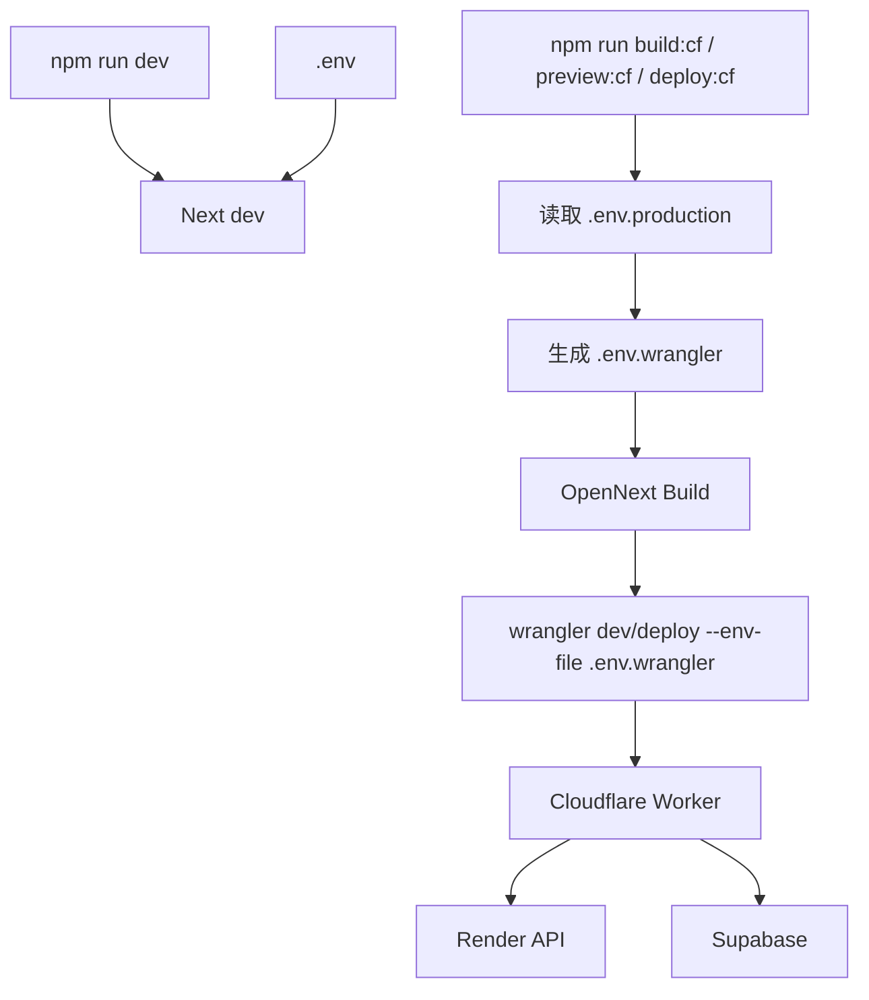

# 部署说明

## 前端（Cloudflare Workers + OpenNext）

### 方案说明
- 使用 OpenNext 将 Next.js 应用构建为 Cloudflare Worker。
- 使用 Wrangler 进行本地预览与发布。
- `next.config.ts` 不再使用 `output: "export"` 或 `output: "standalone"`。

### 项目内配置
- Wrangler 配置文件：`wrangler.toml`
  - `main = ".open-next/worker.js"`
  - `assets.directory = ".open-next/assets"`
  - `compatibility_flags = ["nodejs_compat"]`

### 前端部署图

### 前端部署所需库
- `next`：Next.js 应用框架，提供构建与 SSR/路由能力。
- `react`、`react-dom`：前端运行时基础依赖。
- `@opennextjs/cloudflare`：将 Next.js 构建产物转换为 Cloudflare Worker 可部署结构。
- `wrangler`（CLI）：本地预览与部署到 Cloudflare Workers（来自项目 devDependencies）。
- `dotenv`：用于 `scripts/sync-wrangler-env.mjs` / `scripts/build-cf.mjs`，按环境读取 `.env` 或 `.env.production`。

### 本地与发布命令
- 开发（仅使用 `.env`）：
  - `npm run dev`
- 构建 Worker（使用 `.env.production`）：
  - `npm run build:cf`
- 本地预览 Worker（自动同步 `.env.production` -> `.env.wrangler`）：
  - `npm run preview:cf`
- 发布到 Cloudflare Workers（自动同步 `.env.production` -> `.env.wrangler`）：
  - `npm run deploy:cf`

### 首次发布前准备
- 登录 Cloudflare：
  - `npx wrangler login`
- 按需修改 `wrangler.toml` 中的 `name`。

### 前端需要的环境变量
env 读取规则：
- `npm run dev`：使用 `.env`
- `npm run build:cf`：使用 `.env.production`
- `npm run preview:cf` / `npm run deploy:cf`：先同步 `.env.production` 到 `.env.wrangler`，再构建并执行 wrangler

在 `.env` 与 `.env.production` 中至少需要：
- `NEXT_PUBLIC_SUPABASE_URL`
- `NEXT_PUBLIC_SUPABASE_ANON_KEY`
- `NEXT_PUBLIC_API_BASE_URL`（指向 Render 后端 URL）

如需额外注入非 `NEXT_PUBLIC_*` 变量，可在执行前设置：
- `WRANGLER_ENV_INCLUDE=KEY1,KEY2`
- `WRANGLER_ENV_EXCLUDE=KEY3`

## 后端（Render）

### 服务类型
- Web Service
- Root Directory：`server/`

### 构建/启动命令
- Build Command：
  - `npm install && npm run build`
- Start Command：
  - `npm run start`

### 需要的环境变量
- `SUPABASE_URL`
- `SUPABASE_SERVICE_ROLE_KEY`
- `SUPABASE_ANON_KEY`
- `ALLOWED_ORIGIN`（Cloudflare Worker 前端域名）
- `CRON_SECRET`（可选，用于 `/cron/refresh`）
- `PORT=4000`

## 数据库（Supabase）

### 确认表与 RLS
- 执行 `supabase/schema.sql`
- 如果启用 Auth：
  - `supabase/auth_schema.sql`
  - `supabase/rls-auth.sql`

## CORS / 域名联动
- `ALLOWED_ORIGIN` 设置为你的 Cloudflare Worker 前端域名
- `NEXT_PUBLIC_API_BASE_URL` 设置为 Render 后端 URL
