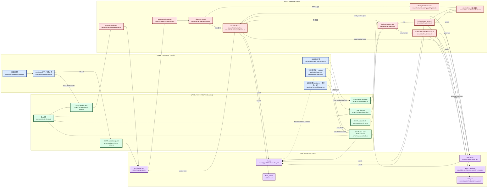

# RSS-Bot ProductMap (Pixel Style)

> 目标：覆盖 RSS 订阅从前端提交、Node 处理、Supabase 落库，到前端展示的完整链路，并标注对应文件。

## Pixel Flow

## File Index (Step -> File)

1. 前端新增订阅入口  
   `/Users/lorenzo.wang/LifeByte/RSS-bot/app/(main)/feeds/new/page.tsx`
2. 前端提交与任务轮询（detecting/converting/validating/creating）  
   `/Users/lorenzo.wang/LifeByte/RSS-bot/components/FeedForm.tsx`
3. 路由入口与鉴权挂载  
   `/Users/lorenzo.wang/LifeByte/RSS-bot/server/src/routes/index.ts`  
   `/Users/lorenzo.wang/LifeByte/RSS-bot/server/src/middleware/auth.ts`
4. Intake API（创建任务、查询任务）  
   `/Users/lorenzo.wang/LifeByte/RSS-bot/server/src/routes/feeds-intake.ts`
5. Intake 任务执行主链（RSS 发现 -> 回退网页转换 -> 创建 feed）  
   `/Users/lorenzo.wang/LifeByte/RSS-bot/server/src/services/feedIntake.ts`  
   `/Users/lorenzo.wang/LifeByte/RSS-bot/server/src/services/discovery.ts`  
   `/Users/lorenzo.wang/LifeByte/RSS-bot/server/src/services/langgraphPipeline.ts`
6. 刷新链路（单 feed / 批量 / cron）  
   `/Users/lorenzo.wang/LifeByte/RSS-bot/server/src/routes/feeds.ts`  
   `/Users/lorenzo.wang/LifeByte/RSS-bot/server/src/routes/refresh.ts`  
   `/Users/lorenzo.wang/LifeByte/RSS-bot/server/src/routes/cron.ts`  
   `/Users/lorenzo.wang/LifeByte/RSS-bot/server/src/services/rss.ts`
7. 正文提纯（评论/点赞/登录等噪音剥离）  
   `/Users/lorenzo.wang/LifeByte/RSS-bot/server/src/services/contentCleaner.ts`  
   `/Users/lorenzo.wang/LifeByte/RSS-bot/app/(main)/feeds/[id]/page.tsx`
8. 前端展示（列表、详情、手动刷新）  
   `/Users/lorenzo.wang/LifeByte/RSS-bot/app/(main)/page.tsx`  
   `/Users/lorenzo.wang/LifeByte/RSS-bot/components/FeedList.tsx`  
   `/Users/lorenzo.wang/LifeByte/RSS-bot/components/FeedDetailActions.tsx`  
   `/Users/lorenzo.wang/LifeByte/RSS-bot/app/(main)/feeds/[id]/page.tsx`
9. Supabase 数据结构定义  
   `/Users/lorenzo.wang/LifeByte/RSS-bot/supabase/schema.sql`

## Supabase 落库点速查

1. `feed_intake_jobs`：创建 intake 任务、更新进度、写入结果/错误。  
2. `feeds`：创建订阅源、更新状态（`idle/fetching/ok/error`）、更新 `source_type` 与抽取规则。  
3. `feed_items`：RSS 条目或 web_monitor 新候选内容入库（正文净化后）。  
4. `web_snapshots`：web_monitor 的内容哈希快照与语义决策（`new/minor_update/noise`）。  
5. `fetch_runs`：每次刷新批次的开始、结束、结果统计。  
6. `feed_events`：订阅新增/删除操作审计。

