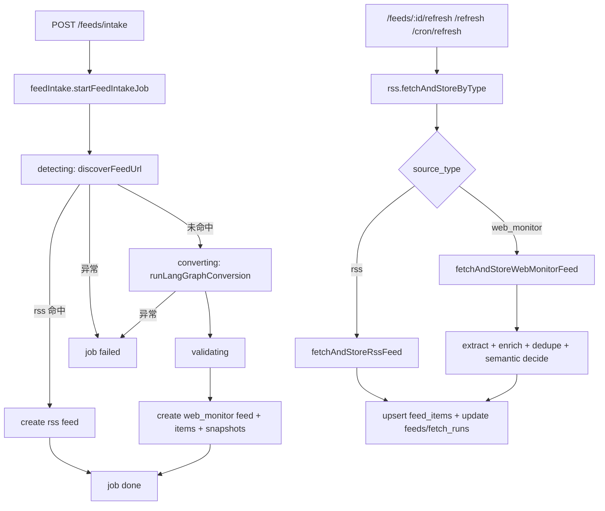

# Services 业务链路流转说明

本文档说明 `server/src/services` 的核心业务流程、模块职责、LLM 触发条件与失败回退策略。

## 1. 模块职责

| 文件 | 作用 |
| --- | --- |
| `discovery.ts` | RSS 发现，输入页面 URL，尝试解析真实 feed URL |
| `feedIntake.ts` | 新增订阅 intake 异步任务流（detecting/converting/validating/creating） |
| `rss.ts` | 刷新主入口，按 `source_type` 分流到 RSS 或 `web_monitor` |
| `langgraphPipeline.ts` | 网页渲染、内容抽取、候选补全、语义判重、LangGraph 编排 |
| `llmAdapter.ts` | 可插拔 LLM 适配器加载与调用封装 |
| `supabase.ts` | Supabase service client 与数据库访问基础层 |

## 2. 新增订阅链路（Intake）

入口：`POST /feeds/intake` -> `routes/feeds-intake.ts` -> `startFeedIntakeJob()`

1. `feedIntake.ts` 创建 `feed_intake_jobs`，状态 `pending`。
2. Worker 进入 `detecting`，调用 `discoverFeedUrl`。
3. 若发现 RSS：
   - 创建 `feeds(source_type='rss')`
   - job 置为 `done`
   - 异步触发一次 `fetchAndStoreByType` 做首次拉取
4. 若 RSS 发现失败：
   - 进入 `converting`，调用 `runLangGraphConversion`
   - `validating` 校验候选内容
   - 创建 `feeds(source_type='web_monitor')`、`feed_items`、`web_snapshots`
   - job 置为 `done`
5. 失败统一写 `error_code/error_message`，job 状态为 `failed`。

## 3. 刷新链路（手动 + 定时）

入口：
- `POST /feeds/:id/refresh`
- `POST /refresh`
- `POST /cron/refresh`

统一进入：`rss.ts -> fetchAndStoreByType(feedId)`

按 `feeds.source_type` 分流：
1. `rss` -> `fetchAndStoreRssFeed`
2. `web_monitor` -> `fetchAndStoreWebMonitorFeed`

### 3.1 RSS 刷新细节

`fetchAndStoreRssFeed` 流程：
1. 拉取 XML（支持 `etag` / `last-modified`）。
2. 解析 item，生成 `content_html/content_text`。
3. 去重（`feed_id + guid`）。
4. 正文补全：
   - 新条目正文过短时，按 `item.link` 抓详情页提取可读正文并回填。
   - 已存在旧条目（同 guid）正文过短时，也会尝试回填更新。
5. upsert `feed_items`，更新 `feeds` 状态与 `fetch_runs`。

### 3.2 Web Monitor 刷新细节

`fetchAndStoreWebMonitorFeed` 流程：
1. `extractCandidatesForRefresh` 抓取页面并按 `extraction_rule` 抽取候选。
2. 若候选正文过短，尝试抓候选 `link` 页面补全正文（部分正文优先）。
3. 哈希去重（`candidate_key + content_hash`）。
4. 对疑似近似内容做语义判重（`semanticDecideNovelty`）。
5. `decision='new'` 才写 `feed_items`；所有判定写 `web_snapshots`。

## 4. LLM 触发条件（关键）

LLM 只在满足条件时调用：

1. 适配器路径存在：`RSS_LLM_ADAPTER_PATH` 非空，且 `llmAdapter.ts` 成功加载模块。
2. 语义判重链路中，启发式未直接命中 `noise/minor_update`。
3. 语义判重预算未超限（当前默认预算 3 次/刷新周期）。

否则全部回退启发式，不阻断主流程。

## 5. 正文补全策略（当前默认）

为解决“只有标题和时间、正文缺失”的问题：

1. RSS 源：
   - 从 `contentSnippet` + `content_html` 文本合并正文。
   - 正文不足时抓原文链接补全。
2. Web Monitor 源：
   - 抽取候选后，若正文不足，抓候选链接补全正文。

相关可调参数（见 `.env.example`）：
- `CONTENT_ENRICH_MIN_CHARS`
- `CONTENT_ENRICH_MAX_LINKS`
- `CONTENT_ENRICH_TIMEOUT_MS`
- `RSS_CONTENT_MIN_CHARS`
- `RSS_ENRICH_MAX_ITEMS`

## 6. 错误与状态回写

1. intake 相关错误：`feed_intake_jobs.error_code/error_message`
2. 刷新相关错误：`feeds.status='error'` + `feeds.last_error`
3. 执行记录：`fetch_runs(status, items_added, error)`
4. Web 语义判定记录：`web_snapshots(llm_decision, semantic_summary)`

## 7. 主流程图

## 8. 调试建议

1. 先看 `feed_intake_jobs` 的 `stage/status/error_code` 判断是否在 intake 阶段失败。
2. 再看 `feeds.last_error` 与 `fetch_runs.error` 判断刷新失败点。
3. 若正文缺失，优先检查：
   - 页面是否可访问
   - `item.link` 是否有效
   - `CONTENT_ENRICH_*` / `RSS_ENRICH_*` 配置是否过于保守
4. 若怀疑 LLM 未生效，检查：
   - `RSS_LLM_ADAPTER_PATH` 是否可加载
   - 日志是否出现 `load_failed/infer_failed/semantic_failed`
